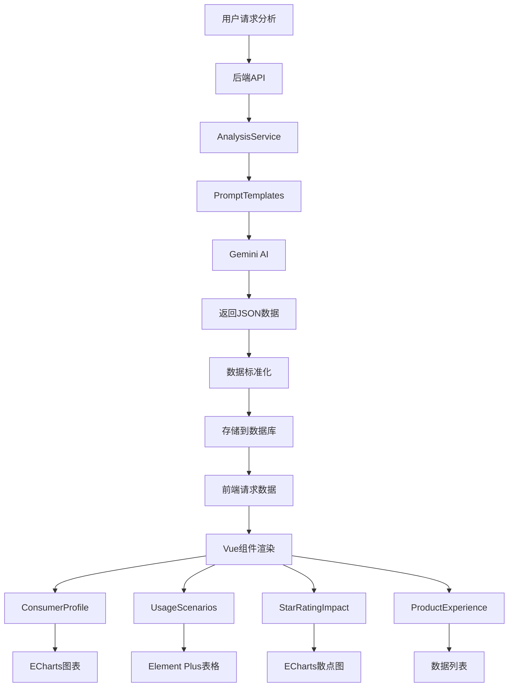

# Design Document - UI数据渲染修复

## Overview

本设计文档针对Web端报告页面的数据渲染和UI显示问题，提供完整的技术修复方案。修复范围包括：

1. **后端AI分析优化**：优化Prompt模板，确保数据完整性（消费者画像4维度、使用场景10+条、星级影响度10+条/星级、产品体验8+条）
2. **前端Vue组件修复**：修复图表渲染、数据映射、翻译功能、UI颜色规范
3. **响应式布局优化**：文本展示（2行+展开+tooltip）、表格宽度控制

## Steering Document Alignment

### Technical Standards (tech.md)
- 遵循KISS原则：最简单的修复方案，不引入新依赖
- 最优算法：ECharts图表配置优化、Vue响应式数据处理
- 代码一致性：保持现有命名规范、组件结构、文件组织

### Project Structure (structure.md)
- 后端：`src/ai/PromptTemplates.js` - AI提示词优化
- 前端：`web/src/components/*.vue` - Vue组件修复
- 样式：统一使用Element Plus + 自定义SCSS
- 不新增文件，仅修改现有组件

## Code Reuse Analysis

### Existing Components to Leverage
- **ECharts**：已有图表库，复用柱状图、散点图配置
- **Element Plus**：已有UI组件库，复用Table、Tooltip、Button
- **PromptTemplates**：已有AI模板类，优化现有方法
- **Vue 3 Composition API**：已有响应式系统，复用ref、computed

### Integration Points
- **AI分析流程**：`AnalysisService.js` → `PromptTemplates.js` → Gemini API
- **数据传递**：后端API → Vue Store → Vue Components
- **图表渲染**：Vue Components → ECharts Instance → DOM

## Architecture

### Modular Design Principles
- **单一职责**：每个Vue组件负责一个分析维度
- **组件隔离**：组件间数据独立，翻译状态不共享
- **服务分层**：Prompt层（AI指令）→ 分析层（数据处理）→ 展示层（Vue组件）
- **工具模块化**：颜色配置、文本截断、tooltip等提取为公共utils



## Components and Interfaces

### Component 1: PromptTemplates (后端AI模板优化)
- **Purpose:** 优化AI提示词，确保返回完整的数据结构
- **Interfaces:** 
  - `getConsumerProfilePrompt(reviews)` - 优化：要求AI返回原评论示例（3条）
  - `getUsageScenariosPrompt(reviews)` - 优化：要求至少10个场景，原因控制在200字内
  - `getStarRatingImpactPrompt(reviews)` - 优化：要求每个星级至少10个关注点
  - `getProductExperienceStrengthsPrompt(reviews)` - 优化：确保至少8条正向观点
  - `getProductExperienceWeaknessesPrompt(reviews)` - 优化：确保至少8条负向观点
- **Dependencies:** 
  - Gemini AI API
  - Logger
- **Reuses:** 现有的系统提示词（getSystemPrompt）

### Component 2: ConsumerProfile.vue (消费者画像组件)
- **Purpose:** 修复四维度柱状图渲染，确保绿色+红色柱子都显示
- **Interfaces:** 
  - Props: `data: { persona, usageTime, usageLocation, behavior }`
  - Events: 无
- **Dependencies:** 
  - ECharts (柱状图)
  - Element Plus (卡片、Tooltip)
- **Reuses:** 
  - 现有的图表配置逻辑
  - 现有的数据映射方法
- **修复要点**：
  1. 图表配置：确保series包含两个bar（绿色+红色）
  2. 数据映射：正确提取positiveCount和negativeCount
  3. Y轴处理：关键词名称显示（keywordCn）
  4. 空数据处理：如果count=0，显示0高度柱子而非隐藏
  5. 添加"原评论示例"区域（3条评论卡片）

### Component 3: UsageScenarios.vue (使用场景组件)
- **Purpose:** 优化表格渲染，支持至少10个场景，原因文本2行显示+展开
- **Interfaces:** 
  - Props: `data: { scenarios: Array<{name, percentage, reason}> }`
  - Events: 无
- **Dependencies:** 
  - Element Plus (Table, Tooltip, Button)
- **Reuses:** 
  - 现有的表格列配置
- **修复要点**：
  1. 数据量：确保显示10+条场景
  2. 提及占比列：显示"百分比 (具体条数)"格式
  3. 原因列：
     - CSS: `line-clamp: 2`（最多2行）
     - 超出：显示"展开"按钮
     - Hover：显示完整tooltip
  4. 列宽控制：原因列max-width限制

### Component 4: StarRatingImpact.vue (星级影响度组件)
- **Purpose:** 修复散点图渲染，确保1-5星每个星级至少10条数据
- **Interfaces:** 
  - Props: `data: { ratingDistribution, keyFactors: Array<{factor, rating, sentiment, reason}> }`
  - Events: 无
- **Dependencies:** 
  - ECharts (散点图)
- **Reuses:** 
  - 现有的散点图配置
- **修复要点**：
  1. 数据结构：keyFactors需包含rating(1-5)和sentiment(positive/negative)
  2. 散点图配置：
     - X轴：1-5星
     - Y轴：情感倾向（正向/负向）
     - 绿点：positive，红点：negative
  3. 数据列表：按星级分组，每个星级至少10条
  4. 删除：星级卡片UI（简化设计）

### Component 5: ProductExperience.vue (产品体验组件)
- **Purpose:** 修复正向/负向观点渲染，确保各至少8条数据
- **Interfaces:** 
  - Props: `data: { strengths: Array, weaknesses: Array }`
  - Events: 无
- **Dependencies:** 
  - Element Plus (Table)
- **Reuses:** 
  - 现有的表格渲染逻辑
- **修复要点**：
  1. 数据量：负向至少8条，正向至少8条
  2. 排序：负向在前，正向在后
  3. 原因列：限制在150字，超出2行+展开
  4. 百分比显示：转为百分数格式（0.35 → 35%）

### Component 6: 翻译功能 (所有组件通用)
- **Purpose:** 修复翻译按钮点击后内容消失的问题
- **实现方案**：
  1. 每个组件维护独立的`currentLang` ref（'zh' / 'en'）
  2. 数据结构：双语字段（如keyword + keywordCn, desc + descCn）
  3. 计算属性：`displayText = computed(() => currentLang.value === 'zh' ? textCn : textEn)`
  4. 按钮逻辑：`toggleLanguage()` 切换currentLang，不隐藏内容
  5. 按钮文本：根据currentLang显示"翻译"/"中文"

### Component 7: UI颜色统一 (全局样式)
- **Purpose:** 将所有紫色渐变替换为蓝色系
- **实现方案**：
  1. 搜索所有`.vue`文件中的紫色代码
  2. 替换规则：
     - `#667eea`, `#764ba2` → `#3B82F6`, `#2563EB`
     - `linear-gradient(...purple...)` → `linear-gradient(135deg, #3B82F6 0%, #2563EB 100%)`
  3. 保持不变：
     - 绿色 `#10B981`（正向数据）
     - 红色 `#EF4444`（负向数据）
     - 背景色 `#FAFBFC`
     - 文字色 `#1F2937`, `#6B7280`

## Data Models

### Model 1: ConsumerProfile（消费者画像数据）
```typescript
interface ConsumerProfile {
  persona: Array<{
    keyword: string;         // 英文关键词
    keywordCn: string;       // 中文翻译
    positiveCount: number;   // 4-5星提及次数
    negativeCount: number;   // 1-3星提及次数
  }>;
  usageTime: Array<同上>;
  usageLocation: Array<同上>;
  behavior: Array<同上>;
  // 新增：原评论示例
  exampleReviews?: Array<{
    rating: number;
    userName: string;
    content: string;
    dimension: string;      // 'persona' | 'usageTime' | 'usageLocation' | 'behavior'
    keyword: string;        // 关联的关键词
  }>;
}
```

### Model 2: UsageScenarios（使用场景数据）
```typescript
interface UsageScenarios {
  scenarios: Array<{
    name: string;           // 场景名称（3-10字）
    percentage: number;     // 占比（0-1小数或整数百分比，前端统一处理）
    count?: number;         // 提及次数（新增字段）
    description?: string;   // 场景描述
    reason: string;         // 原因说明（建议200字以内）
  }>;
}
```

### Model 3: StarRatingImpact（星级影响度数据）
```typescript
interface StarRatingImpact {
  ratingDistribution: {
    '5star': number;        // 百分比
    '4star': number;
    '3star': number;
    '2star': number;
    '1star': number;
  };
  keyFactors: Array<{
    factor: string;         // 关注点名称
    rating: 1 | 2 | 3 | 4 | 5; // 星级
    sentiment: 'positive' | 'negative'; // 情感倾向
    percentage: number;     // 提及占比
    reason: string;         // 详细原因
  }>;
}
```

### Model 4: ProductExperience（产品体验数据）
```typescript
interface ProductExperience {
  strengths: Array<{
    desc: string;           // 英文描述
    descCn: string;         // 中文描述
    percentage: number;     // 占比（0-1小数）
    reason: string;         // 详细原因（建议150字以内）
  }>;
  weaknesses: Array<同上>;
}
```

## Error Handling

### Error Scenarios

1. **Scenario 1: AI返回数据不完整（如某维度为空数组）**
   - **Handling:** 
     - 后端：PromptTemplates强制要求最小数据量，如果AI返回不足，重新调用或返回默认数据
     - 前端：检查数据长度，如果不足显示警告提示"数据量较少，仅供参考"
   - **User Impact:** 用户看到部分数据 + 警告提示，而非空白页面

2. **Scenario 2: 图表渲染失败（ECharts初始化错误）**
   - **Handling:** 
     - Try-catch包裹图表初始化代码
     - 失败时显示友好错误信息："图表加载失败，请刷新页面重试"
     - Logger记录详细错误信息
   - **User Impact:** 用户看到错误提示，可以刷新重试

3. **Scenario 3: 翻译切换失败（数据缺少英文字段）**
   - **Handling:** 
     - 检查双语字段是否存在
     - 如果缺少英文字段，保持显示中文，按钮变灰
     - Tooltip提示"该数据暂无英文翻译"
   - **User Impact:** 用户知道英文翻译不可用，但不影响查看中文数据

4. **Scenario 4: 文本过长导致布局溢出**
   - **Handling:** 
     - CSS: `word-break: break-all` + `line-clamp: 2`
     - JS: 计算文本行数，超过2行显示"展开"按钮
     - Tooltip: hover时显示完整内容
   - **User Impact:** 用户看到整洁的2行文本，可以展开或hover查看完整内容

5. **Scenario 5: 颜色替换遗漏导致UI不一致**
   - **Handling:** 
     - 使用全局搜索确保所有紫色代码被替换
     - 提取颜色常量到SCSS变量或CSS变量
     - Code review检查颜色一致性
   - **User Impact:** 用户看到统一的蓝色系UI

## Testing Strategy

### Unit Testing
- PromptTemplates测试：验证生成的Prompt包含所有必需指令
- 数据标准化测试：验证percentage转换逻辑（整数→小数）
- 组件数据映射测试：验证props到图表数据的转换正确性

### Integration Testing
- AI分析流程测试：mock Gemini API，验证返回数据结构符合预期
- 图表渲染测试：验证ECharts配置正确，图表元素正确显示
- 翻译功能测试：验证切换语言后内容正确切换且不消失

### End-to-End Testing
使用Chrome DevTools MCP进行真实环境验证：
1. 创建新报告，等待分析完成
2. 验证消费者画像：
   - 4个维度图表正常显示
   - 每个维度至少5条数据
   - 绿色+红色柱子都显示
   - 底部有3条原评论示例
3. 验证使用场景：
   - 至少10个场景
   - 原因文本不超出界面
   - 展开按钮正常工作
   - Hover显示完整tooltip
4. 验证星级影响度：
   - 散点图正常显示
   - 1-5星都有数据点
   - 绿点（正向）红点（负向）区分明显
   - 无星级卡片（已删除）
5. 验证产品体验：
   - 负向观点至少8条
   - 正向观点至少8条
   - 百分比格式正确
6. 验证翻译功能：
   - 点击翻译按钮，内容切换为英文
   - 再次点击，切换回中文
   - 内容不消失
7. 验证UI颜色：
   - 所有渐变元素使用蓝色系
   - 无紫色残留

## Implementation Priority

### Phase 1: 后端AI优化（高优先级）
- 修复PromptTemplates，确保数据完整性
- 优化数据结构，添加exampleReviews、count等字段

### Phase 2: 前端数据渲染（高优先级）
- 修复ConsumerProfile四维度图表
- 修复UsageScenarios表格（2行+展开）
- 修复StarRatingImpact散点图
- 修复ProductExperience数据列表

### Phase 3: 翻译功能修复（中优先级）
- 修复所有组件的翻译逻辑
- 确保切换语言不导致内容消失

### Phase 4: UI颜色统一（低优先级）
- 全局搜索替换紫色为蓝色
- 验证颜色一致性

### Phase 5: E2E验证（最终验证）
- 使用Chrome DevTools完整测试
- 确认所有功能正常

## Performance Considerations

- **图表渲染优化**：使用ECharts的`lazyUpdate`和`notMerge`选项减少重绘
- **数据处理优化**：前端只处理显示逻辑，不重新计算percentage
- **组件懒加载**：大数据量时使用虚拟滚动（如果需要）
- **内存优化**：组件卸载时销毁ECharts实例

## Responsive Design

- **表格列宽**：使用`max-width`限制，`overflow: hidden`防止溢出
- **文本换行**：`word-break: break-all` + `white-space: normal`
- **Tooltip定位**：根据屏幕尺寸自适应位置
- **移动端适配**：虽然主要面向桌面端，但确保基本可用性

## Accessibility

- **颜色对比度**：确保蓝色系与背景的对比度符合WCAG 2.0标准
- **Tooltip可访问性**：键盘用户可通过Tab+Enter触发
- **图表替代文本**：为图表添加aria-label描述
- **按钮语义**：翻译按钮使用明确的文本，不仅仅是图标


