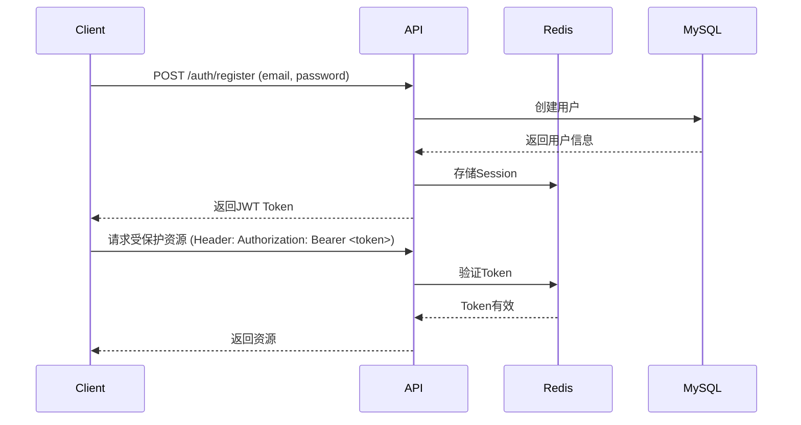

# 即贸 Amazon 评论智能分析 - 后端API设计文档

**版本**: v1.0  
**最后更新**: 2025-10-21  
**技术栈**: Node.js 18+ | Express 4.18+ | MySQL 8.0+ | Redis 7.0+ | JWT | Puppeteer

---

## 📋 目录

1. [API架构设计](#1-api架构设计)
2. [认证与授权](#2-认证与授权)
3. [核心API接口](#3-核心api接口)
4. [错误处理规范](#4-错误处理规范)
5. [数据库设计](#5-数据库设计)
6. [安全策略](#6-安全策略)

---

## 1. API架构设计

### 1.1 技术栈选型

| 技术 | 版本 | 用途 |
|------|------|------|
| Node.js | 18.x LTS | 运行时环境 |
| Express | 4.18+ | Web框架 |
| MySQL | 8.0+ | 关系型数据库 |
| Redis | 7.0+ | 缓存、会话存储 |
| Puppeteer | 21.0+ | 浏览器自动化爬虫 |
| JWT | jsonwebtoken 9.0+ | 用户认证 |
| Axios | 1.6+ | HTTP客户端 |

### 1.2 项目目录结构

```
backend/
├── src/
│   ├── config/           # 配置文件
│   │   ├── database.js   # 数据库配置
│   │   ├── redis.js      # Redis配置
│   │   └── app.js        # 应用配置
│   ├── controllers/      # 控制器
│   │   ├── auth.controller.js
│   │   ├── review.controller.js
│   │   ├── report.controller.js
│   │   └── user.controller.js
│   ├── services/         # 业务逻辑层
│   │   ├── crawler.service.js      # 爬虫服务
│   │   ├── ai-analysis.service.js  # AI分析服务
│   │   └── report.service.js       # 报告服务
│   ├── models/           # 数据模型
│   │   ├── User.js
│   │   ├── Product.js
│   │   ├── Report.js
│   │   └── Review.js
│   ├── middlewares/      # 中间件
│   │   ├── auth.middleware.js
│   │   ├── rateLimit.middleware.js
│   │   └── errorHandler.middleware.js
│   ├── routes/           # 路由
│   │   ├── auth.routes.js
│   │   ├── review.routes.js
│   │   ├── report.routes.js
│   │   └── user.routes.js
│   ├── utils/            # 工具函数
│   │   ├── logger.js
│   │   ├── response.js
│   │   └── validator.js
│   └── app.js            # 应用入口
├── tests/                # 测试文件
├── .env.example          # 环境变量示例
├── package.json
└── README.md
```

### 1.3 API Base URL

**开发环境**: `http://localhost:3000/api/v1`  
**生产环境**: `https://api.yourdomain.com/api/v1`

---

## 2. 认证与授权

### 2.1 JWT认证流程



### 2.2 用户注册

**接口**: `POST /api/v1/auth/register`

**请求体**:
```json
{
  "email": "user@example.com",
  "password": "SecurePassword123!",
  "username": "张三"
}
```

**响应**:
```json
{
  "success": true,
  "message": "注册成功",
  "data": {
    "user": {
      "id": 1001,
      "email": "user@example.com",
      "username": "张三",
      "created_at": "2025-10-21T10:30:00Z"
    },
    "token": "eyJhbGciOiJIUzI1NiIsInR5cCI6IkpXVCJ9...",
    "expiresIn": "7d"
  }
}
```

### 2.3 用户登录

**接口**: `POST /api/v1/auth/login`

**请求体**:
```json
{
  "email": "user@example.com",
  "password": "SecurePassword123!"
}
```

**响应**:
```json
{
  "success": true,
  "message": "登录成功",
  "data": {
    "user": {
      "id": 1001,
      "email": "user@example.com",
      "username": "张三",
      "subscription_plan": "professional",
      "remaining_quota": 27
    },
    "token": "eyJhbGciOiJIUzI1NiIsInR5cCI6IkpXVCJ9...",
    "expiresIn": "7d"
  }
}
```

### 2.4 Token刷新

**接口**: `POST /api/v1/auth/refresh`

**请求头**:
```
Authorization: Bearer <old_token>
```

**响应**:
```json
{
  "success": true,
  "data": {
    "token": "eyJhbGciOiJIUzI1NiIsInR5cCI6IkpXVCJ9...",
    "expiresIn": "7d"
  }
}
```

---

## 3. 核心API接口

### 3.1 评论爬取与分析

#### 3.1.1 触发爬取任务

**接口**: `POST /api/v1/reviews/crawl`

**请求头**:
```
Authorization: Bearer <token>
Content-Type: application/json
```

**请求体**:
```json
{
  "asin": "B08M5LT97G",
  "marketplace": "amazon.com",
  "amazonCookies": "session-id=123-4567890-1234567; ubid-main=456-7890123-4567890; ...",
  "crawlOptions": {
    "maxReviews": 500,
    "includeInternational": true,
    "gentleMode": true
  }
}
```

**参数说明**:
- `asin`: Amazon商品唯一标识符
- `marketplace`: Amazon站点（amazon.com, amazon.co.uk等）
- `amazonCookies`: 用户Amazon登录Cookies
- `crawlOptions.maxReviews`: 最大爬取评论数（默认500）
- `crawlOptions.includeInternational`: 是否包含国际评论
- `crawlOptions.gentleMode`: 温柔模式（降低爬取速度，减少被封风险）

**响应**:
```json
{
  "success": true,
  "message": "爬取任务已创建",
  "data": {
    "taskId": "task_20251021_abc123",
    "status": "pending",
    "estimatedTime": "2-3分钟",
    "createdAt": "2025-10-21T10:35:00Z"
  }
}
```

#### 3.1.2 查询爬取进度

**接口**: `GET /api/v1/reviews/crawl/:taskId/progress`

**响应**:
```json
{
  "success": true,
  "data": {
    "taskId": "task_20251021_abc123",
    "status": "crawling",
    "progress": {
      "current": 245,
      "total": 500,
      "percentage": 49
    },
    "message": "正在爬取评论... (245/500)",
    "startedAt": "2025-10-21T10:35:05Z"
  }
}
```

**状态值**:
- `pending`: 等待中
- `crawling`: 爬取中
- `analyzing`: AI分析中
- `completed`: 已完成
- `failed`: 失败

#### 3.1.3 获取分析结果

**接口**: `GET /api/v1/reviews/analysis/:taskId`

**响应**:
```json
{
  "success": true,
  "data": {
    "taskId": "task_20251021_abc123",
    "asin": "B08M5LT97G",
    "productTitle": "SCHVUBENR 3.5 Inch Apple Slicer - Professional Apple Cutter",
    "totalReviews": 487,
    "averageRating": 4.3,
    "analysis": {
      "consumerProfile": {
        "genderRatio": { "male": 45, "female": 55 },
        "persona": [
          { "desc": "孙子女孙", "percent": "3%", "reason": "..." }
        ],
        "usageTime": [
          { "desc": "每日使用", "percent": "5%", "reason": "..." }
        ],
        "usageLocation": [
          { "desc": "公寓", "percent": "3%", "reason": "..." }
        ],
        "behavior": [
          { "desc": "均匀切苹果", "percent": "22%", "reason": "..." }
        ]
      },
      "usageScenario": [
        { "desc": "切苹果", "percent": "41%", "reason": "顾客发现这个去核器对于切苹果用于零食或者食非常有用。" }
      ],
      "unmetNeeds": [
        { "desc": "持久耐用", "percent": "35%", "reason": "许多客户将该产品称为耐用产品，寿命长。" }
      ],
      "positiveReviews": [
        { "desc": "易于使用", "percent": "41%", "reason": "顾客发现这个去核器易于使用且受欢迎。" }
      ],
      "negativeReviews": [
        { "desc": "难以使用", "percent": "37%", "reason": "用户发现使用这个去核器太大苹果时很困难。" }
      ],
      "purchaseMotivation": [
        { "desc": "Good Value", "percent": "50%", "reason": "顾客发现这个去核器物有所值。" }
      ]
    },
    "reportId": "rpt_20251021_xyz789",
    "createdAt": "2025-10-21T10:38:25Z"
  }
}
```

### 3.2 报告管理

#### 3.2.1 获取报告列表

**接口**: `GET /api/v1/reports`

**查询参数**:
- `page`: 页码（默认1）
- `limit`: 每页数量（默认20）
- `sortBy`: 排序字段（created_at, asin）
- `order`: 排序方式（desc, asc）

**响应**:
```json
{
  "success": true,
  "data": {
    "reports": [
      {
        "reportId": "rpt_20251021_xyz789",
        "asin": "B08M5LT97G",
        "productTitle": "SCHVUBENR Apple Slicer",
        "totalReviews": 487,
        "averageRating": 4.3,
        "createdAt": "2025-10-21T10:38:25Z",
        "thumbnail": "https://cdn.yourdomain.com/thumbnails/B08M5LT97G.jpg"
      }
    ],
    "pagination": {
      "currentPage": 1,
      "totalPages": 5,
      "totalItems": 97,
      "itemsPerPage": 20
    }
  }
}
```

#### 3.2.2 获取报告详情

**接口**: `GET /api/v1/reports/:reportId`

**响应**: 与3.1.3相同的完整分析数据

#### 3.2.3 删除报告

**接口**: `DELETE /api/v1/reports/:reportId`

**响应**:
```json
{
  "success": true,
  "message": "报告已删除"
}
```

#### 3.2.4 导出报告

**接口**: `POST /api/v1/reports/:reportId/export`

**请求体**:
```json
{
  "format": "pdf"
}
```

**参数说明**:
- `format`: 导出格式（pdf, excel）

**响应**:
```json
{
  "success": true,
  "data": {
    "downloadUrl": "https://cdn.yourdomain.com/reports/rpt_20251021_xyz789.pdf",
    "expiresAt": "2025-10-22T10:40:00Z"
  }
}
```

### 3.3 用户管理

#### 3.3.1 获取用户信息

**接口**: `GET /api/v1/users/profile`

**响应**:
```json
{
  "success": true,
  "data": {
    "id": 1001,
    "email": "user@example.com",
    "username": "张三",
    "subscription": {
      "plan": "professional",
      "status": "active",
      "startDate": "2025-10-01",
      "endDate": "2025-11-01",
      "quota": {
        "total": 30,
        "used": 3,
        "remaining": 27
      }
    },
    "createdAt": "2025-09-15T08:20:00Z"
  }
}
```

#### 3.3.2 更新用户信息

**接口**: `PUT /api/v1/users/profile`

**请求体**:
```json
{
  "username": "张三丰",
  "avatar": "https://cdn.yourdomain.com/avatars/user1001.jpg"
}
```

**响应**:
```json
{
  "success": true,
  "message": "用户信息已更新",
  "data": {
    "id": 1001,
    "username": "张三丰",
    "avatar": "https://cdn.yourdomain.com/avatars/user1001.jpg"
  }
}
```

### 3.4 订阅管理

#### 3.4.1 获取订阅套餐

**接口**: `GET /api/v1/subscriptions/plans`

**响应**:
```json
{
  "success": true,
  "data": {
    "plans": [
      {
        "id": "free",
        "name": "免费版",
        "price": 0,
        "features": {
          "monthlyQuota": 3,
          "maxReviews": 100,
          "aiModel": "GLM-4",
          "support": "社区支持"
        }
      },
      {
        "id": "basic",
        "name": "基础版",
        "price": 99,
        "features": {
          "monthlyQuota": 30,
          "maxReviews": 500,
          "aiModel": "GPT-4o / Claude 3.5",
          "support": "邮件支持"
        }
      },
      {
        "id": "professional",
        "name": "专业版",
        "price": 299,
        "features": {
          "monthlyQuota": -1,
          "maxReviews": 2000,
          "aiModel": "GPT-4o / Claude 3.5",
          "competitorAnalysis": true,
          "support": "优先支持"
        }
      }
    ]
  }
}
```

#### 3.4.2 创建订阅

**接口**: `POST /api/v1/subscriptions`

**请求体**:
```json
{
  "planId": "professional",
  "paymentMethod": "alipay"
}
```

**响应**:
```json
{
  "success": true,
  "data": {
    "orderId": "ord_20251021_abc123",
    "paymentUrl": "https://pay.yourdomain.com/order/ord_20251021_abc123",
    "qrCode": "https://cdn.yourdomain.com/qrcodes/ord_20251021_abc123.png",
    "expiresAt": "2025-10-21T11:00:00Z"
  }
}
```

---

## 4. 错误处理规范

### 4.1 HTTP状态码

| 状态码 | 说明 | 使用场景 |
|--------|------|----------|
| 200 | OK | 请求成功 |
| 201 | Created | 资源创建成功 |
| 400 | Bad Request | 请求参数错误 |
| 401 | Unauthorized | 未认证或Token失效 |
| 403 | Forbidden | 无权限访问 |
| 404 | Not Found | 资源不存在 |
| 429 | Too Many Requests | 请求频率超限 |
| 500 | Internal Server Error | 服务器内部错误 |
| 503 | Service Unavailable | 服务暂不可用 |

### 4.2 错误响应格式

```json
{
  "success": false,
  "error": {
    "code": "INVALID_ASIN",
    "message": "无效的ASIN格式",
    "details": "ASIN必须是10个字符的字母数字组合",
    "timestamp": "2025-10-21T10:40:00Z",
    "path": "/api/v1/reviews/crawl",
    "requestId": "req_abc123xyz"
  }
}
```

### 4.3 错误代码列表

| 错误代码 | HTTP状态码 | 说明 |
|----------|-----------|------|
| `INVALID_CREDENTIALS` | 401 | 用户名或密码错误 |
| `TOKEN_EXPIRED` | 401 | Token已过期 |
| `INVALID_TOKEN` | 401 | Token无效 |
| `QUOTA_EXCEEDED` | 429 | 超出配额限制 |
| `INVALID_ASIN` | 400 | 无效的ASIN |
| `INVALID_COOKIES` | 400 | Amazon Cookies无效 |
| `CRAWL_FAILED` | 500 | 爬取失败 |
| `AI_ANALYSIS_FAILED` | 500 | AI分析失败 |
| `REPORT_NOT_FOUND` | 404 | 报告不存在 |
| `PAYMENT_FAILED` | 400 | 支付失败 |

---

## 5. 数据库设计

### 5.1 用户表 (users)

```sql
CREATE TABLE users (
  id BIGINT UNSIGNED AUTO_INCREMENT PRIMARY KEY,
  email VARCHAR(255) NOT NULL UNIQUE,
  password_hash VARCHAR(255) NOT NULL,
  username VARCHAR(100),
  avatar VARCHAR(500),
  subscription_plan ENUM('free', 'basic', 'professional', 'enterprise') DEFAULT 'free',
  subscription_status ENUM('active', 'expired', 'cancelled') DEFAULT 'active',
  subscription_start_date DATETIME,
  subscription_end_date DATETIME,
  monthly_quota INT DEFAULT 3,
  used_quota INT DEFAULT 0,
  created_at TIMESTAMP DEFAULT CURRENT_TIMESTAMP,
  updated_at TIMESTAMP DEFAULT CURRENT_TIMESTAMP ON UPDATE CURRENT_TIMESTAMP,
  INDEX idx_email (email),
  INDEX idx_subscription_plan (subscription_plan)
) ENGINE=InnoDB DEFAULT CHARSET=utf8mb4 COLLATE=utf8mb4_unicode_ci;
```

### 5.2 产品表 (products)

```sql
CREATE TABLE products (
  id BIGINT UNSIGNED AUTO_INCREMENT PRIMARY KEY,
  asin VARCHAR(20) NOT NULL UNIQUE,
  marketplace VARCHAR(50) NOT NULL,
  title VARCHAR(500),
  image_url VARCHAR(500),
  average_rating DECIMAL(3,2),
  total_reviews INT,
  price DECIMAL(10,2),
  last_crawled_at TIMESTAMP,
  created_at TIMESTAMP DEFAULT CURRENT_TIMESTAMP,
  updated_at TIMESTAMP DEFAULT CURRENT_TIMESTAMP ON UPDATE CURRENT_TIMESTAMP,
  INDEX idx_asin (asin),
  INDEX idx_marketplace (marketplace)
) ENGINE=InnoDB DEFAULT CHARSET=utf8mb4 COLLATE=utf8mb4_unicode_ci;
```

### 5.3 报告表 (reports)

```sql
CREATE TABLE reports (
  id BIGINT UNSIGNED AUTO_INCREMENT PRIMARY KEY,
  report_id VARCHAR(50) NOT NULL UNIQUE,
  user_id BIGINT UNSIGNED NOT NULL,
  product_id BIGINT UNSIGNED NOT NULL,
  asin VARCHAR(20) NOT NULL,
  total_reviews_analyzed INT,
  analysis_data JSON,
  status ENUM('pending', 'completed', 'failed') DEFAULT 'pending',
  created_at TIMESTAMP DEFAULT CURRENT_TIMESTAMP,
  updated_at TIMESTAMP DEFAULT CURRENT_TIMESTAMP ON UPDATE CURRENT_TIMESTAMP,
  FOREIGN KEY (user_id) REFERENCES users(id) ON DELETE CASCADE,
  FOREIGN KEY (product_id) REFERENCES products(id) ON DELETE CASCADE,
  INDEX idx_report_id (report_id),
  INDEX idx_user_id (user_id),
  INDEX idx_asin (asin)
) ENGINE=InnoDB DEFAULT CHARSET=utf8mb4 COLLATE=utf8mb4_unicode_ci;
```

### 5.4 爬取任务表 (crawl_tasks)

```sql
CREATE TABLE crawl_tasks (
  id BIGINT UNSIGNED AUTO_INCREMENT PRIMARY KEY,
  task_id VARCHAR(50) NOT NULL UNIQUE,
  user_id BIGINT UNSIGNED NOT NULL,
  asin VARCHAR(20) NOT NULL,
  marketplace VARCHAR(50) NOT NULL,
  status ENUM('pending', 'crawling', 'analyzing', 'completed', 'failed') DEFAULT 'pending',
  progress INT DEFAULT 0,
  total_target INT,
  error_message TEXT,
  started_at TIMESTAMP,
  completed_at TIMESTAMP,
  created_at TIMESTAMP DEFAULT CURRENT_TIMESTAMP,
  FOREIGN KEY (user_id) REFERENCES users(id) ON DELETE CASCADE,
  INDEX idx_task_id (task_id),
  INDEX idx_user_id (user_id),
  INDEX idx_status (status)
) ENGINE=InnoDB DEFAULT CHARSET=utf8mb4 COLLATE=utf8mb4_unicode_ci;
```

### 5.5 Redis缓存设计

**键命名规范**:
```
jimao:session:{userId}           # 用户会话（JWT）
jimao:reviews:{asin}              # 评论数据缓存
jimao:analysis:{taskId}           # AI分析结果缓存
jimao:ratelimit:{userId}          # 用户请求频率限制
jimao:crawl:progress:{taskId}    # 爬取进度实时更新
```

**示例**:
```redis
# 评论数据缓存（7天过期）
SET jimao:reviews:B08M5LT97G "{\"reviews\": [...]}" EX 604800

# 爬取进度实时更新
HSET jimao:crawl:progress:task_abc123 current 245 total 500 percentage 49
```

---

## 6. 安全策略

### 6.1 请求频率限制

```javascript
// middlewares/rateLimit.middleware.js
const rateLimit = require('express-rate-limit');

const apiLimiter = rateLimit({
  windowMs: 15 * 60 * 1000, // 15分钟
  max: 100, // 最多100次请求
  message: {
    success: false,
    error: {
      code: 'RATE_LIMIT_EXCEEDED',
      message: '请求频率过高，请稍后再试'
    }
  }
});

const crawlLimiter = rateLimit({
  windowMs: 60 * 60 * 1000, // 1小时
  max: 10, // 最多10次爬取请求
  keyGenerator: (req) => req.user.id,
  message: {
    success: false,
    error: {
      code: 'CRAWL_LIMIT_EXCEEDED',
      message: '每小时最多爬取10次'
    }
  }
});

module.exports = { apiLimiter, crawlLimiter };
```

### 6.2 输入验证

```javascript
// utils/validator.js
const Joi = require('joi');

const crawlRequestSchema = Joi.object({
  asin: Joi.string().regex(/^[A-Z0-9]{10}$/).required(),
  marketplace: Joi.string().valid('amazon.com', 'amazon.co.uk', 'amazon.de').required(),
  amazonCookies: Joi.string().min(50).required(),
  crawlOptions: Joi.object({
    maxReviews: Joi.number().min(10).max(2000).default(500),
    includeInternational: Joi.boolean().default(true),
    gentleMode: Joi.boolean().default(true)
  })
});

module.exports = { crawlRequestSchema };
```

### 6.3 密码加密

```javascript
// utils/password.js
const bcrypt = require('bcrypt');

async function hashPassword(password) {
  const saltRounds = 12;
  return await bcrypt.hash(password, saltRounds);
}

async function verifyPassword(password, hash) {
  return await bcrypt.compare(password, hash);
}

module.exports = { hashPassword, verifyPassword };
```

### 6.4 Cookies安全存储

```javascript
// services/crawler.service.js
const crypto = require('crypto');

// 加密存储用户Amazon Cookies（仅在内存中使用，不存数据库）
function encryptCookies(cookies) {
  const algorithm = 'aes-256-cbc';
  const key = Buffer.from(process.env.ENCRYPTION_KEY, 'hex');
  const iv = crypto.randomBytes(16);
  const cipher = crypto.createCipheriv(algorithm, key, iv);
  
  let encrypted = cipher.update(cookies, 'utf8', 'hex');
  encrypted += cipher.final('hex');
  
  return iv.toString('hex') + ':' + encrypted;
}

function decryptCookies(encryptedData) {
  const algorithm = 'aes-256-cbc';
  const key = Buffer.from(process.env.ENCRYPTION_KEY, 'hex');
  const parts = encryptedData.split(':');
  const iv = Buffer.from(parts[0], 'hex');
  const encrypted = parts[1];
  const decipher = crypto.createDecipheriv(algorithm, key, iv);
  
  let decrypted = decipher.update(encrypted, 'hex', 'utf8');
  decrypted += decipher.final('utf8');
  
  return decrypted;
}
```

---

## 7. 部署配置

### 7.1 环境变量 (.env)

```bash
# 应用配置
NODE_ENV=production
PORT=3000
APP_NAME=即贸Amazon评论分析
APP_URL=https://api.yourdomain.com

# 数据库配置
DB_HOST=127.0.0.1
DB_PORT=3306
DB_NAME=jimao_amazon
DB_USER=jimao_user
DB_PASSWORD=your_secure_password

# Redis配置
REDIS_HOST=127.0.0.1
REDIS_PORT=6379
REDIS_PASSWORD=your_redis_password

# JWT配置
JWT_SECRET=your_jwt_secret_key_here_min_32_chars
JWT_EXPIRES_IN=7d

# AI API配置
OPENAI_API_KEY=sk-...
ANTHROPIC_API_KEY=sk-ant-...
ZHIPU_API_KEY=...

# 腾讯云COS配置
COS_SECRET_ID=...
COS_SECRET_KEY=...
COS_BUCKET=jimao-reports-1234567890
COS_REGION=ap-guangzhou

# 加密密钥（32字节hex）
ENCRYPTION_KEY=0123456789abcdef0123456789abcdef0123456789abcdef0123456789abcdef

# 支付配置
ALIPAY_APP_ID=...
ALIPAY_PRIVATE_KEY=...
WECHAT_PAY_MCH_ID=...
```

### 7.2 启动脚本 (package.json)

```json
{
  "scripts": {
    "start": "node src/app.js",
    "dev": "nodemon src/app.js",
    "test": "jest --coverage",
    "migrate": "node scripts/migrate.js",
    "seed": "node scripts/seed.js"
  }
}
```

---

**文档维护人**: 即贸技术团队  
**技术支持**: tech@yourdomain.com

