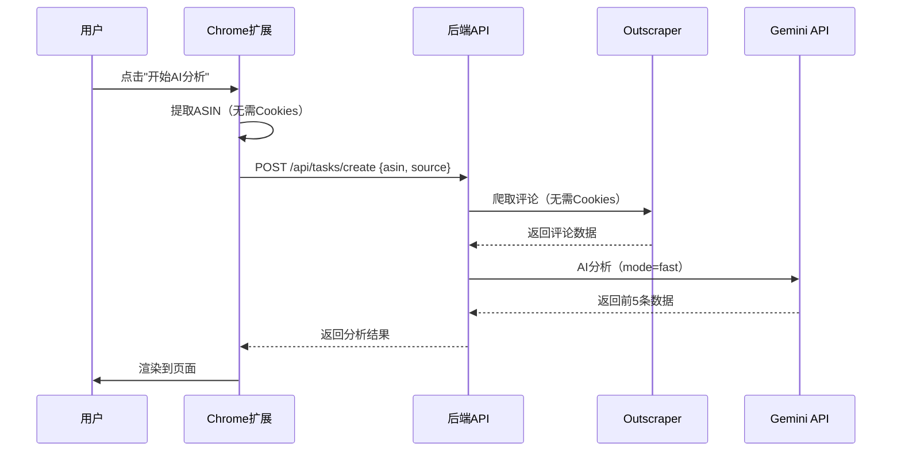
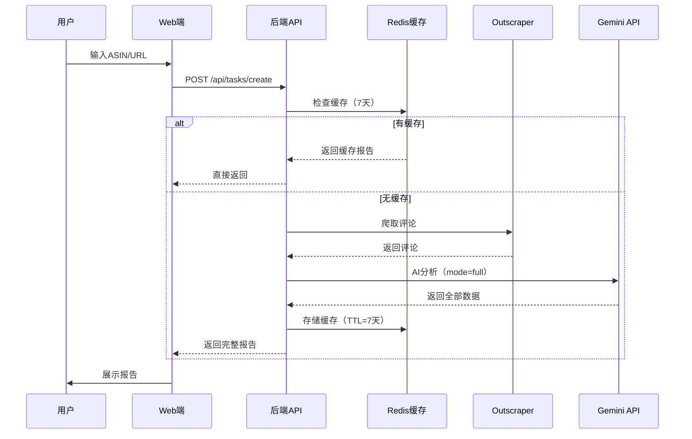

# 即贸 Amazon评论分析系统 - 简化架构设计方案

**版本**: v2.0  
**设计日期**: 2025-10-25  
**优化目标**: 简化技术栈、统一服务、降低维护成本

---

## 📋 目录

1. [架构简化概述](#1-架构简化概述)
2. [技术栈变更](#2-技术栈变更)
3. [核心组件设计](#3-核心组件设计)
4. [数据流设计](#4-数据流设计)
5. [成本分析](#5-成本分析)
6. [实施计划](#6-实施计划)

---

## 1. 架构简化概述

### 1.1 简化原则

```yaml
简化原则:
  - principle_1: "统一爬虫策略"
    description: "Chrome扩展和Web端统一使用Outscraper，移除自建Puppeteer"
    
  - principle_2: "单一AI Provider"
    description: "只使用Gemini 2.5 Pro，移除Groq Provider"
    
  - principle_3: "无需用户Cookies"
    description: "不再收集用户Amazon登录信息，提高隐私保护"
    
  - principle_4: "降级策略"
    description: "Outscraper失败时降级到RapidAPI"
```

### 1.2 变更对比

| 组件 | 之前 | 现在 | 变化 |
|------|------|------|------|
| **主爬虫** | PuppeteerCrawler (自建) | Outscraper API | ✅ 简化 |
| **备用爬虫** | RapidAPI | RapidAPI | ✅ 保持 |
| **AI Provider** | Gemini + Groq | 仅 Gemini 2.5 Pro | ✅ 简化 |
| **Cookies处理** | 收集、加密、存储 | 不再需要 | ✅ 移除 |
| **Chrome扩展** | 提取Cookies | 只提取ASIN | ✅ 简化 |

---

## 2. 技术栈变更

### 2.1 移除的组件

```yaml
removed_components:
  crawlers:
    - name: "PuppeteerCrawler"
      files:
        - "src/crawlers/PuppeteerCrawler.js"
      dependencies:
        - "puppeteer"
        - "puppeteer-extra"
        - "puppeteer-extra-plugin-stealth"
      reason: "使用Outscraper替代，无需自建爬虫"
      
  ai_providers:
    - name: "GroqProvider"
      files:
        - "src/ai/GroqProvider.js"
      dependencies:
        - "groq-sdk"
      reason: "统一使用Gemini 2.5 Pro"
      
  utilities:
    - name: "Cookie加密工具"
      files:
        - "src/utils/cookieEncryption.js"
      reason: "不再收集用户Cookies"
```

### 2.2 保留的组件

```yaml
retained_components:
  crawlers:
    - name: "OutscraperCrawler"
      status: "新增"
      priority: "主要爬虫"
      
    - name: "RapidAPICrawler"
      status: "保留"
      priority: "备用爬虫"
      
  ai_provider:
    - name: "GeminiProvider"
      model: "gemini-2.0-flash-exp"
      status: "保留并优化"
      
  services:
    - "AnalysisService (简化)"
    - "TaskService"
    - "ReportService"
```

### 2.3 新增组件

```yaml
new_components:
  - name: "CrawlerFacade"
    file: "src/crawlers/CrawlerFacade.js"
    purpose: "统一爬虫接口，管理Outscraper和RapidAPI的降级策略"
    
  - name: "OutscraperCrawler"
    file: "src/crawlers/OutscraperCrawler.js"
    purpose: "Outscraper API封装"
    
  - name: "RapidAPICrawler"
    file: "src/crawlers/RapidAPICrawler.js"
    purpose: "RapidAPI封装"
```

---

## 3. 核心组件设计

### 3.1 CrawlerFacade（统一爬虫接口）

```javascript
/**
 * 爬虫门面类 - 统一爬虫接口
 * 
 * 职责：
 * 1. 管理多个爬虫Provider（Outscraper、RapidAPI）
 * 2. 实现降级策略（Outscraper失败 → RapidAPI）
 * 3. 统一返回数据格式
 */
class CrawlerFacade {
  constructor() {
    this.outscraper = new OutscraperCrawler();
    this.rapidapi = new RapidAPICrawler();
  }
  
  /**
   * 爬取评论（带降级策略）
   */
  async crawlReviews(asin, options = {}) {
    // 优先使用Outscraper
    try {
      logger.info(`🔄 使用 Outscraper 爬取评论: ${asin}`);
      const reviews = await this.outscraper.crawlReviews(asin, options);
      logger.info(`✅ Outscraper 成功，获取 ${reviews.length} 条评论`);
      return reviews;
    } catch (error) {
      logger.warn(`❌ Outscraper 失败: ${error.message}`);
      
      // 降级到RapidAPI
      try {
        logger.info(`🔄 降级到 RapidAPI...`);
        const reviews = await this.rapidapi.crawlReviews(asin, options);
        logger.info(`✅ RapidAPI 成功，获取 ${reviews.length} 条评论`);
        return reviews;
      } catch (error2) {
        logger.error(`❌ RapidAPI 也失败: ${error2.message}`);
        throw new Error('所有爬虫都失败了，请稍后重试');
      }
    }
  }
  
  /**
   * 获取产品信息
   */
  async getProductInfo(asin, marketplace = 'amazon.com') {
    try {
      return await this.outscraper.getProductInfo(asin, marketplace);
    } catch (error) {
      logger.warn(`获取产品信息失败: ${error.message}`);
      return {
        title: 'Amazon Product',
        price: 'N/A',
        rating: 0,
        reviewsCount: 0
      };
    }
  }
}
```

### 3.2 OutscraperCrawler

```javascript
/**
 * Outscraper爬虫（主要爬虫）
 * 
 * 特点：
 * - 高成功率（99%+）
 * - 无需用户Cookies
 * - 自动处理反爬虫
 * - 返回结构化JSON
 * 
 * 成本：$0.002/次
 */
class OutscraperCrawler {
  constructor() {
    this.apiKey = process.env.OUTSCRAPER_API_KEY;
    this.baseUrl = 'https://api.app.outscraper.com';
  }
  
  /**
   * 爬取评论
   */
  async crawlReviews(asin, options = {}) {
    const url = `${this.baseUrl}/amazon-reviews`;
    
    const response = await axios.post(url, {
      query: `https://www.amazon.com/product-reviews/${asin}`,
      limit: options.maxReviews || 500,
      language: 'all',
      async: false
    }, {
      headers: {
        'X-API-KEY': this.apiKey
      }
    });
    
    // 格式化为统一格式
    return this.formatReviews(response.data);
  }
  
  /**
   * 获取产品信息
   */
  async getProductInfo(asin, marketplace) {
    const url = `${this.baseUrl}/amazon-product`;
    
    const response = await axios.post(url, {
      query: asin,
      domain: marketplace
    }, {
      headers: {
        'X-API-KEY': this.apiKey
      }
    });
    
    return response.data;
  }
}
```

### 3.3 简化的AnalysisService

```javascript
/**
 * AI分析服务（简化版）
 * 
 * 变更：
 * - 移除Groq支持
 * - 只使用GeminiProvider
 * - 简化配置逻辑
 */
class AnalysisService {
  constructor() {
    // 直接使用Gemini，不再判断AI_PROVIDER
    this.provider = new GeminiProvider();
    logger.info('🤖 使用 Gemini 2.5 Pro 作为AI分析引擎');
  }
  
  /**
   * 执行完整的六维度分析（保持不变）
   */
  async analyzeAll(reviews, mode = 'fast') {
    // 并发执行7个分析任务
    const [
      consumerProfileResult,
      usageScenariosResult,
      starRatingImpactResult,
      strengthsResult,
      weaknessesResult,
      purchaseMotivationResult,
      unmetNeedsResult
    ] = await Promise.allSettled([
      this.analyzeConsumerProfile(reviews, mode),
      this.analyzeUsageScenarios(reviews, mode),
      this.analyzeStarRatingImpact(reviews, mode),
      this.analyzeProductStrengths(reviews, mode),
      this.analyzeProductWeaknesses(reviews, mode),
      this.analyzePurchaseMotivation(reviews, mode),
      this.analyzeUnmetNeeds(reviews, mode)
    ]);
    
    // 处理结果
    return {
      consumerProfile: this.handleResult(consumerProfileResult),
      usageScenarios: this.handleResult(usageScenariosResult),
      starRatingImpact: this.handleResult(starRatingImpactResult),
      productExperience: {
        strengths: this.handleResult(strengthsResult),
        weaknesses: this.handleResult(weaknessesResult)
      },
      purchaseMotivation: this.handleResult(purchaseMotivationResult),
      unmetNeeds: this.handleResult(unmetNeedsResult)
    };
  }
}
```

---

## 4. 数据流设计

### 4.1 Chrome扩展流程（简化）



### 4.2 Web端流程



---

## 5. 成本分析

### 5.1 单次分析成本

| 项目 | 之前方案 | 现在方案 | 变化 |
|------|---------|---------|------|
| **爬虫成本** | ¥0（自建Puppeteer） | $0.002（Outscraper） | +$0.002 |
| **服务器成本** | ¥300/月（运行Puppeteer） | ¥0（无需服务器） | -¥300/月 |
| **AI成本** | $0.01（Gemini/Groq） | $0.01（仅Gemini） | 不变 |
| **单次总成本** | ¥0.07 | $0.012 (¥0.09) | +¥0.02 |

### 5.2 月度成本（1000份报告）

| 项目 | 之前方案 | 现在方案 | 节省 |
|------|---------|---------|------|
| **API成本** | $10 | $12 | -$2 |
| **服务器成本** | ¥300 | ¥0 | +¥300 |
| **总成本（人民币）** | ¥372 | ¥87 | **节省¥285/月** |

**结论**：虽然单次API成本略增，但无需服务器，总成本大幅降低。

### 5.3 缓存优化

```yaml
cache_strategy:
  ttl: "7 days"
  expected_hit_rate: "40%"
  
  cost_with_cache:
    actual_api_calls: "1000 × (1 - 40%) = 600次"
    outscraper_cost: "600 × $0.002 = $1.2"
    gemini_cost: "600 × $0.01 = $6"
    total_monthly: "$7.2 ≈ ¥52"
  
  final_savings: "¥285 + ¥35(缓存) = ¥320/月"
```

---

## 6. 实施计划

### 6.1 第一阶段：移除废弃组件（完成度：0%）

```yaml
phase_1:
  name: "清理废弃代码"
  tasks:
    - task: "删除GroqProvider.js"
      status: "pending"
      
    - task: "删除PuppeteerCrawler.js"
      status: "pending"
      
    - task: "删除cookieEncryption.js"
      status: "pending"
      
    - task: "移除相关依赖包"
      status: "pending"
      dependencies:
        - "puppeteer"
        - "puppeteer-extra"
        - "groq-sdk"
```

### 6.2 第二阶段：实现新组件（完成度：0%）

```yaml
phase_2:
  name: "创建新组件"
  tasks:
    - task: "创建OutscraperCrawler.js"
      status: "pending"
      
    - task: "创建RapidAPICrawler.js"
      status: "pending"
      
    - task: "创建CrawlerFacade.js"
      status: "pending"
      
    - task: "简化AnalysisService.js"
      status: "pending"
```

### 6.3 第三阶段：修改Chrome扩展（完成度：0%）

```yaml
phase_3:
  name: "优化Chrome扩展"
  tasks:
    - task: "移除Cookies提取逻辑"
      status: "pending"
      file: "chrome-extension/content.js"
      
    - task: "简化extractProductInfo函数"
      status: "pending"
      
    - task: "更新API调用（移除cookies参数）"
      status: "pending"
```

### 6.4 第四阶段：配置和文档（完成度：0%）

```yaml
phase_4:
  name: "更新配置和文档"
  tasks:
    - task: "更新.env.example"
      status: "pending"
      
    - task: "更新package.json"
      status: "pending"
      
    - task: "更新README.md"
      status: "pending"
      
    - task: "创建简化架构设计文档"
      status: "in_progress"
```

### 6.5 第五阶段：测试验证（完成度：0%）

```yaml
phase_5:
  name: "测试和验证"
  tasks:
    - task: "Chrome扩展功能测试"
      status: "pending"
      
    - task: "Web端功能测试"
      status: "pending"
      
    - task: "降级策略测试"
      status: "pending"
      
    - task: "成本监控测试"
      status: "pending"
```

---

## 7. 风险与缓解

### 7.1 风险评估

| 风险 | 影响 | 概率 | 缓解措施 |
|------|------|------|---------|
| Outscraper API故障 | 高 | 低 | 降级到RapidAPI |
| API成本超预算 | 中 | 中 | 7天缓存+成本告警 |
| Gemini API限流 | 高 | 低 | 失败重试3次+队列管理 |
| 爬取成功率下降 | 中 | 低 | 双爬虫策略 |

### 7.2 回滚方案

```yaml
rollback_plan:
  condition: "新方案出现严重问题"
  
  steps:
    - "恢复GroqProvider.js"
    - "恢复PuppeteerCrawler.js"
    - "恢复Chrome扩展Cookies逻辑"
    - "切换回旧版API"
  
  time_required: "< 30分钟"
  
  backup:
    location: "git分支: feature/v1-backup"
    description: "保留旧版本完整代码"
```

---

## 8. 成功指标

### 8.1 技术指标

```yaml
technical_metrics:
  - metric: "代码行数"
    target: "减少30%"
    current: "~5000行"
    expected: "~3500行"
    
  - metric: "依赖包数量"
    target: "减少5个"
    current: "25个"
    expected: "20个"
    
  - metric: "分析成功率"
    target: "> 95%"
    
  - metric: "平均响应时间"
    target: "< 60秒"
```

### 8.2 业务指标

```yaml
business_metrics:
  - metric: "月度成本"
    target: "< ¥100/月（1000份报告）"
    
  - metric: "缓存命中率"
    target: "> 40%"
    
  - metric: "用户满意度"
    target: "保持或提升"
```

---

## 9. 时间表

```yaml
timeline:
  week_1:
    - "创建设计文档 ✅"
    - "删除废弃文件"
    - "创建新组件框架"
    
  week_2:
    - "实现OutscraperCrawler"
    - "实现CrawlerFacade"
    - "修改AnalysisService"
    
  week_3:
    - "修改Chrome扩展"
    - "更新配置文件"
    - "单元测试"
    
  week_4:
    - "集成测试"
    - "性能测试"
    - "上线部署"
```

---

**文档维护人**: 即贸技术团队  
**最后更新**: 2025-10-25  
**下次评审**: 2025-11-25


