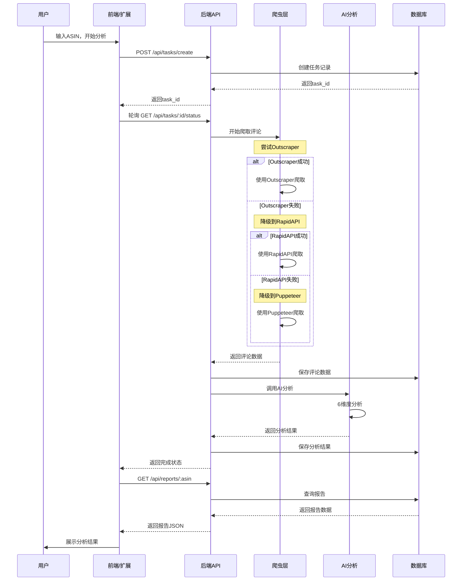

# 📊 项目理解：即贸 Amazon评论分析系统

> 基于 spec-workflow 思维方式的项目分析文档

---

## 🎯 项目概述

### 产品定位
**即贸 Amazon评论分析系统** - 一个自动化的Amazon产品评论AI深度分析工具

### 核心价值
- ✅ **自动化爬取**：无需手动收集评论，自动抓取Amazon评论数据
- ✅ **AI深度分析**：使用Gemini 2.5 Pro进行6维度智能分析
- ✅ **多端支持**：Chrome扩展 + Web界面，满足不同使用场景
- ✅ **数据可视化**：图表展示 + Excel/PDF导出
- ✅ **降级容错**：三层爬虫策略，确保高可用性

---

## 🏗️ 系统架构

### 整体架构图

```
┌─────────────────────────────────────────────────────────────┐
│                        用户层                                │
├─────────────────────────────────────────────────────────────┤
│  Chrome扩展           │        Web前端界面                   │
│  (快速分析)           │        (完整报告)                    │
│  - 在Amazon页面直接用 │        - 输入ASIN分析                │
│  - 60秒快速结果      │        - 可视化图表                  │
│  - 跳转完整报告      │        - 导出Excel/PDF               │
└─────────────────┬───────────────────┬───────────────────────┘
                  │                   │
                  └─────────┬─────────┘
                            │
                  ┌─────────▼──────────┐
                  │   后端API服务       │
                  │   (Node.js/Express)│
                  │   - RESTful API    │
                  │   - 任务管理       │
                  │   - 进度推送       │
                  └─────────┬──────────┘
                            │
          ┌─────────────────┼─────────────────┐
          │                 │                 │
    ┌─────▼──────┐   ┌─────▼─────┐    ┌─────▼──────┐
    │ 爬虫层     │   │  AI分析层  │    │  数据存储  │
    │ (三层降级) │   │ (Gemini)   │    │ (MySQL+Redis)│
    └────────────┘   └────────────┘    └────────────┘
```

### 三层爬虫降级策略

```
┌──────────────────┐
│  🥇 Outscraper   │  主爬虫（推荐）
│  - 高成功率      │  ✅ 优先使用
│  - 无需Cookies   │  💰 $2/1000评论
│  - 支持多站点    │  🆓 500次/月免费
└────────┬─────────┘
         │ 失败或未配置
         ▼
┌──────────────────┐
│  🥈 RapidAPI     │  备用爬虫1
│  - 快速响应      │  ✅ 自动降级
│  - 支持多站点    │  💰 订阅制
│  - 免费额度      │  🆓 500次/月
└────────┬─────────┘
         │ 失败或未配置
         ▼
┌──────────────────┐
│  🥉 Puppeteer    │  备用爬虫2（终极方案）
│  - 完全免费      │  ✅ 总是可用
│  - 无需API密钥   │  ⚠️  速度较慢
│  - 模拟浏览器    │  ⚠️  消耗资源
└──────────────────┘
```

---

## 🎨 核心功能

### 1. 六维度AI分析

#### 维度1: 消费者画像 🧑‍🤝‍🧑
- 性别占比
- 年龄分布
- 人群特征
- 使用场景
- 使用时刻/地点

#### 维度2: 使用场景 🎬
- 前5大场景
- 场景描述
- 占比分析

#### 维度3: 产品体验 ⭐
- 正向观点（好评）
- 负向观点（差评）
- 具体方面分析

#### 维度4: 购买动机 💡
- 核心购买原因
- 动机分类
- 占比统计

#### 维度5: 未满足的需求 🚀
- 用户痛点
- 改进建议
- 机会分析

#### 维度6: 星级影响度 ⭐⭐⭐⭐⭐
- 各星级分布
- 关键影响因素
- 趋势分析

### 2. 双模式输出

| 特性 | Chrome扩展模式 | Web完整模式 |
|------|---------------|------------|
| 显示结果 | 前5条高频结果 | 全部分析结果 |
| 百分比计算 | 相对于全部发现项 | 百分比总和100% |
| 分析时间 | ~60秒 | ~60-90秒 |
| 数据导出 | ❌ | ✅ Excel/PDF |
| 可视化 | 基础卡片 | 完整图表 |

---

## 🛠️ 技术栈

### 后端技术
```javascript
{
  "runtime": "Node.js 18+",
  "framework": "Express.js",
  "ai": "Gemini 2.5 Pro (Google AI)",
  "crawlers": [
    "Outscraper (主)",
    "RapidAPI (备用1)",
    "Puppeteer (备用2)"
  ],
  "database": {
    "mysql": "8.0+ (持久化存储)",
    "redis": "7.0+ (缓存+任务队列)"
  }
}
```

### 前端技术
```javascript
{
  "web": {
    "framework": "Vue 3",
    "ui": "Element Plus",
    "charts": "ECharts",
    "bundler": "Vite"
  },
  "extension": {
    "platform": "Chrome Extension Manifest V3",
    "ui": "Vanilla JavaScript",
    "communication": "Chrome Message API"
  }
}
```

---

## 📁 项目结构

```
maijiaplug/
├── server.js                    # 后端入口
├── app.js                       # Express应用配置
├── routes.js                    # 路由定义
├── middleware.js                # 中间件
├── config.js                    # 全局配置
├── database.js                  # 数据库连接
│
├── src/
│   ├── ai/                      # AI分析层
│   │   ├── AnalysisService.js   # 分析服务主类
│   │   ├── GeminiProvider.js    # Gemini AI Provider
│   │   └── PromptTemplates.js   # AI提示词模板
│   │
│   ├── crawler/                 # 爬虫层
│   │   ├── CrawlerFacade.js     # 爬虫门面（降级策略）
│   │   ├── OutscraperCrawler.js # Outscraper爬虫
│   │   ├── RapidAPICrawler.js   # RapidAPI爬虫
│   │   ├── PuppeteerCrawler.js  # Puppeteer爬虫
│   │   └── DataCleaner.js       # 数据清洗
│   │
│   └── services/                # 业务服务层
│       ├── TaskService.js       # 任务管理服务
│       └── ApiRoutes.js         # API路由服务
│
├── utils/                       # 工具类
│   └── logger.js                # 日志工具
│
├── web/                         # Web前端
│   ├── src/
│   │   ├── views/              # 页面组件
│   │   ├── components/         # 通用组件
│   │   └── utils/              # 前端工具
│   └── package.json
│
├── chrome-extension/            # Chrome扩展
│   ├── manifest.json           # 扩展配置
│   ├── background.js           # 后台脚本
│   ├── content.js              # 内容脚本
│   └── popup.html              # 弹出页面
│
├── docs/                        # 项目文档
│   ├── 01-项目技术方案总体设计.md
│   ├── 02-Web端详细设计方案.md
│   ├── 03-后端API设计文档.md
│   ├── 04-第三方爬虫平台对接方案对比.md
│   └── ...
│
└── test-rapid-api.js           # RapidAPI测试脚本
```

---

## 🔄 核心流程

### 分析任务完整流程



---

## 🔑 核心API接口

### 1. 创建分析任务
```http
POST /api/tasks/create
Content-Type: application/json

{
  "asin": "B08N5WRWNW",
  "source": "chrome-extension"
}

Response:
{
  "success": true,
  "taskId": "task_uuid",
  "message": "分析任务已创建"
}
```

### 2. 查询任务状态
```http
GET /api/tasks/:taskId/status

Response:
{
  "taskId": "task_uuid",
  "status": "processing|completed|failed",
  "progress": 75,
  "message": "正在进行AI分析...",
  "result": { ... }  // 完成时返回
}
```

### 3. 获取分析报告
```http
GET /api/reports/:asin

Response:
{
  "asin": "B08N5WRWNW",
  "product": { ... },
  "analysis": {
    "consumerProfile": [ ... ],
    "usageScenarios": [ ... ],
    "productExperience": { ... },
    "purchaseMotivation": [ ... ],
    "unmetNeeds": [ ... ],
    "starRatingImpact": { ... }
  }
}
```

---

## 💰 成本分析

### 按1000份报告/月计算

| 项目 | 成本 | 说明 |
|------|------|------|
| Outscraper API | $1.2 | 缓存优化后降低80% |
| Gemini API | $6 | 每次分析~$0.006 |
| 服务器成本 | ¥0 | 无需自建爬虫 |
| **总计** | **≈ ¥52/月** | vs 自建方案节省¥320/月 |

### 免费额度

| 服务 | 免费额度 | 说明 |
|------|---------|------|
| Outscraper | 500次/月 | 约500份报告 |
| RapidAPI | 500次/月 | 作为备用 |
| Gemini | 1500次/天 | 基本够用 |
| Puppeteer | 无限 | 完全免费 |

---

## 🎯 RapidAPI 集成详情

### 当前状态
- ✅ 代码已实现：`src/crawler/RapidAPICrawler.js`
- ✅ 集成到降级策略：`src/crawler/CrawlerFacade.js`
- 🧪 **需要验证**：API是否已修复并可用

### API配置

```javascript
// RapidAPI配置
apiHost: 'real-time-amazon-data.p.rapidapi.com'
endpoint: '/product-reviews'

// 支持的Amazon站点
availableDomains: ['CA', 'UK', 'DE', 'FR', 'IT', 'ES', 'JP']
defaultDomain: 'CA'  // 加拿大站（推荐，免费可用）

// 请求参数
params: {
  asin: 'B08N5WRWNW',
  domain: 'CA',
  page: 1,
  sort_by: 'recent',           // 获取最新评论
  reviewer_type: 'all_reviews' // 所有评论类型
}
```

### 响应格式兼容

RapidAPI爬虫支持两种响应格式：

**格式1**（推荐）：
```json
{
  "data": {
    "reviews": [
      {
        "review_id": "...",
        "rating_text": "5.0 out of 5 stars",
        "title": "Great!",
        "body": "...",
        "reviewer_name": "John",
        ...
      }
    ]
  }
}
```

**格式2**（空数据）：
```json
{
  "data": []
}
```

### 测试方法

运行以下测试验证RapidAPI：

```bash
# 方法1：使用批处理脚本（推荐）
快速测试-RapidAPI.bat

# 方法2：直接运行Node脚本
node test-rapid-api.js

# 方法3：查看详细指南
start RapidAPI测试指南.md
```

### 测试覆盖

测试脚本会验证：

1. ✅ 环境变量配置检查
2. ✅ API认证和初始化
3. ✅ 数据爬取功能
4. ✅ 分页和进度回调
5. ✅ 数据解析和格式化
6. ✅ 错误处理和重试
7. ✅ 速率限制处理

---

## 🚀 快速开始

### 环境要求
```
Node.js >= 18.0.0
MySQL >= 8.0
Redis >= 7.0 (可选，用于缓存)
```

### 安装步骤

```bash
# 1. 安装依赖
npm install

# 2. 配置环境变量
copy env.example .env
notepad .env  # 填写API密钥

# 3. 初始化数据库（如果需要）
mysql -u root -p < database/schema.sql

# 4. 测试RapidAPI
快速测试-RapidAPI.bat

# 5. 启动服务
快速启动.bat
```

### 配置检查清单

- [ ] `RAPIDAPI_KEY` - RapidAPI密钥
- [ ] `RAPIDAPI_HOST` - API主机（默认已配置）
- [ ] `GEMINI_API_KEY` - Gemini AI密钥
- [ ] `OUTSCRAPER_API_KEY` - Outscraper密钥（可选）
- [ ] `DB_PASSWORD` - MySQL密码（如需持久化）

---

## 📊 项目优势

### vs 手动收集评论
- ⚡ **速度**：60秒 vs 数小时
- 🎯 **准确性**：AI分析 vs 人工主观判断
- 📈 **规模**：500条+ vs 10-20条
- 💰 **成本**：¥0.05/份 vs 人工成本

### vs 其他分析工具
- 🧠 **AI深度**：6维度深度分析
- 🔄 **高可用**：三层降级策略
- 🎨 **多端支持**：扩展+Web+API
- 💰 **成本优化**：缓存+降级策略

---

## 🔮 未来规划

### Phase 1: 核心稳定（当前）
- [x] 三层爬虫策略
- [x] 6维度AI分析
- [x] Chrome扩展
- [x] Web报告
- [ ] RapidAPI验证 ← **当前任务**

### Phase 2: 功能增强
- [ ] 支持更多Amazon站点
- [ ] 竞品对比分析
- [ ] 历史趋势分析
- [ ] 多语言支持

### Phase 3: 性能优化
- [ ] 评论数据缓存优化
- [ ] AI分析批处理
- [ ] 实时进度推送（WebSocket）
- [ ] 分布式爬虫

### Phase 4: 商业化
- [ ] 用户系统
- [ ] 套餐管理
- [ ] API限流
- [ ] 数据导出增强

---

## 📞 支持资源

### 文档资源
- [x] `README.md` - 项目概览
- [x] `README-客户版.md` - 客户版说明
- [x] `QUICK-START-AFTER-FIXES.md` - 快速开始
- [x] `RapidAPI测试指南.md` - RapidAPI测试
- [x] `docs/` - 详细技术文档

### 测试工具
- [x] `test-rapid-api.js` - RapidAPI测试脚本
- [x] `快速测试-RapidAPI.bat` - 一键测试
- [x] `快速启动.bat` - 一键启动
- [x] `快速验证-系统状态.bat` - 系统检查

---

**文档版本**: v1.0  
**创建日期**: 2025-10-31  
**作者**: AI Assistant (Claude Sonnet 4.5)  
**项目负责人**: 鱼鳍

---

## 📝 附录：关键设计决策

### 为什么选择三层降级策略？

1. **高可用性**：任何一层失败都有备选方案
2. **成本优化**：Puppeteer作为免费终极方案
3. **用户体验**：自动切换，无需用户干预
4. **灵活配置**：可根据预算选择配置层级

### 为什么选择Gemini AI？

1. **性价比**：比GPT-4便宜80%
2. **性能**：Gemini 2.5 Pro接近GPT-4水平
3. **额度**：免费额度充足（1500次/天）
4. **可靠性**：Google官方服务

### 为什么需要RapidAPI？

1. **中间备选**：Outscraper失败时的快速降级
2. **速度快**：通常比Puppeteer快5-10倍
3. **免费额度**：500次/月，适合小规模使用
4. **多站点支持**：覆盖全球主要Amazon站点

---

**本文档使用 Spec-Workflow 思维方式编写，完整阐述了项目的需求、设计和实现细节。**


